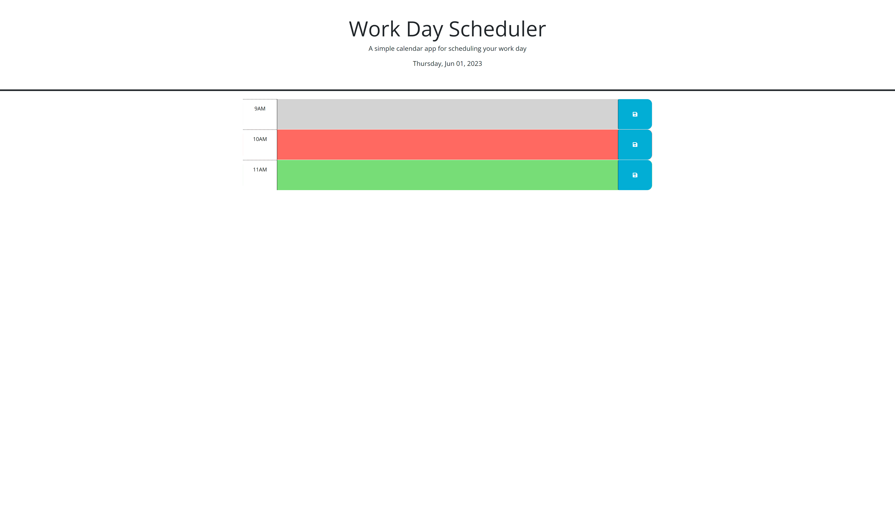

# Scheduler-Calendar

## Description
The Calendar Application is a browser-based tool powered by jQuery that allows users to save events for each hour of the day. It features a visually appealing interface with a grid layout displaying hours from morning to evening. Users can easily add event details by clicking on an hour and typing in the information. The application dynamically updates HTML and CSS to reflect changes and provides visual cues for current, past, and future hours. By working on this project, I gained experience in jQuery, javaScript,  manipulation, event handling, and responsive design principles.

## Contents

- [Installation](#installation)
- [ScreanShots](#usage)
- [Credits](#credits)
- [License](#license)

## Installation

The first step is to install the Visual Studio Code on your local system. Then install the extention "Open in browser" to open the html file. Clone the repository and commit and push changes.

## Mockup
### Screenshot

## Credits

"I received valuable assistance from my instructor, TAs, and the "Ask BCS" feature in the Slack App while completing this project. Their help enabled me to learn a lot and complete the project successfully."

## License

I care about sharing improvements and working in a community 
- Apache requires Apache License 2.0

- Cloud Native Computing Foundation requires Apache License 2.0

- GNU recommends GNU GPLv3 for most programs

- npm packages overwhelmingly use the MIT or the very similar ISC licenses

- OpenBSD prefers the ISC License

- Rust crates are overwhelmingly licensed under both MIT and Apache License 2.0

- WordPress plugins and themes must be GNU GPLv2 (or later)

## Deployed Link

https://marjan-mn.github.io/Scheduler-Calendar/

